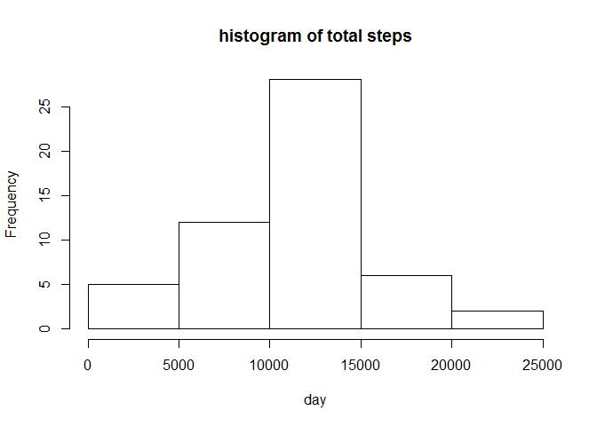
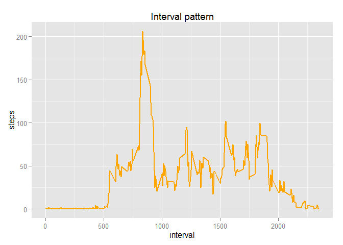

# Reproducible Research: Peer Assessment 1


## Loading and preprocessing the data
First, we load required libraries. Then the activity data is loaded. We show a summary of activity data.

```r
library(data.table)
library(ggplot2)
library(knitr)
activity_data <- read.csv('activity.csv', header = TRUE, sep = "," , colClasses = c("numeric","character","numeric"))

head(activity_data)
```

```
##   steps       date interval
## 1    NA 2012-10-01        0
## 2    NA 2012-10-01        5
## 3    NA 2012-10-01       10
## 4    NA 2012-10-01       15
## 5    NA 2012-10-01       20
## 6    NA 2012-10-01       25
```

Here, the date and interval are converted.


```r
activity_data$date <- as.Date(activity_data$date, format = "%Y-%m-%d")
activity_data$interval <- as.factor(activity_data$interval)
```
After converting the data, the structure of the data is shown using str().

```r
str(activity_data)
```

```
## 'data.frame':	17568 obs. of  3 variables:
##  $ steps   : num  NA NA NA NA NA NA NA NA NA NA ...
##  $ date    : Date, format: "2012-10-01" "2012-10-01" ...
##  $ interval: Factor w/ 288 levels "0","5","10","15",..: 1 2 3 4 5 6 7 8 9 10 ...
```
## Whaat is mean total number of steps taken per day?

The histogram and mean total number of steps per day is calculated as:


```r
total <- aggregate(steps~ date, activity_data, sum, na.rm = TRUE)
hist(total$steps, main = "histogram of total steps", xlab = "day")
```

 
mean and median:

```r
mean(total$steps)
median(total$steps)
```

```
## [1] 10766.19
## [1] 10765
```

## What is the average daily activity pattern?

We make a time plot of 5 mininterval as x-axis and the avarage number of steps taken, averaged across all days as y-axis.


```r
steps_interval <- aggregate(activity_data$steps, by = list(interval = activity_data$interval), FUN = mean, na.rm = TRUE)

steps_interval$interval <- as.integer(levels(steps_interval$interval)[steps_interval$interval])
colnames(steps_interval) <- c("interval","steps")
ggplot(steps_interval, aes(x = interval, y = steps)) +geom_line(color = "orange", size =1) +
  labs(title="Interval pattern", x = "interval", y = "steps")
```

 
Which 5-minute interval, on average across all the days in the dataset, contains the maximum number of steps?


```r
steps_interval[which.max(steps_interval$steps),]
```

```
##     interval    steps
## 104      835 206.1698
```
## Imputing missing values
Note that there are a number of days/intervals where there are missing values (coded as NA). The presence of missing days may introduce bias into some calculations or summaries of the data.

Calculate and report the total number of missing values in the dataset (i.e. the total number of rows with NAs)


```r
sum(is.na(activity_data))
```

```
## [1] 2304
```

Devise a strategy for filling in all of the missing values in the dataset. The strategy does not need to be sophisticated. For example, you could use the mean/median for that day, or the mean for that 5-minute interval, etc.

We replace the missing values in dataset using mean value. 

```r
mean_steps <- aggregate(steps ~interval,  activity_data, FUN=mean)
fillNA <- numeric()
for(i in 1:nrow(activity_data)){
  obs <- activity_data[i,]
  if(is.na(obs$steps)){
    steps <- subset(mean_steps, interval ==obs$interval)$steps
  }else{
    steps <-obs$steps
    
  }
  fillNA <- c(fillNA,steps)
}
activity_noNA <- activity_data
activity_noNA$steps <- fillNA
```


```r
sum(is.na(activity_noNA))
```

```
## [1] 0
```


Make a histogram of the total number of steps taken each day and Calculate and report the mean and median total number of steps taken per day. Do these values differ from the estimates from the first part of the assignment? What is the impact of imputing missing data on the estimates of the total daily number of steps?

```r
total2 <- aggregate(steps ~ date, activity_noNA, sum, na.rm = TRUE)
hist(total2$steps, main = "total daily number of steps", xlab = "day", col="blue")
```

 
Mean and Median:

```r
mean(total2$steps)
median(total2$steps)
```

```
## [1] 10766.19
## [1] 10766.19
```
We see that the mean is the same since NAs are replaced by mean but the median is different from the previous part. 


## Are there differences in activity patterns between weekdays and weekends?

For this part the weekdays() function may be of some help here. Use the dataset with the filled-in missing values for this part.

Create a new factor variable in the dataset with two levels - "weekday" and "weekend" indicating whether a given date is a weekday or weekend day.

Make a panel plot containing a time series plot (i.e. type = "l") of the 5-minute interval (x-axis) and the average number of steps taken, averaged across all weekday days or weekend days (y-axis). See the README file in the GitHub repository to see an example of what this plot should look like using simulated data.


```r
weekdays_steps <- function(data) {
    weekdays_steps <- aggregate(data$steps, by=list(interval = data$interval),
                          FUN=mean, na.rm=T)
    # convert to integers for plotting
    weekdays_steps$interval <- 
            as.integer(levels(weekdays_steps$interval)[weekdays_steps$interval])
    colnames(weekdays_steps) <- c("interval", "steps")
    weekdays_steps
}

data_by_weekdays <- function(data) {
    data$weekday <- 
            as.factor(weekdays(data$date)) # weekdays
    weekend_data <- subset(data, weekday %in% c("Saturday","Sunday"))
    weekday_data <- subset(data, !weekday %in% c("Saturday","Sunday"))

    weekend_steps <- weekdays_steps(weekend_data)
    weekday_steps <- weekdays_steps(weekday_data)

    weekend_steps$dayofweek <- rep("weekend", nrow(weekend_steps))
    weekday_steps$dayofweek <- rep("weekday", nrow(weekday_steps))

    data_by_weekdays <- rbind(weekend_steps, weekday_steps)
    data_by_weekdays$dayofweek <- as.factor(data_by_weekdays$dayofweek)
    data_by_weekdays
}

data_weekdays <- data_by_weekdays(activity_noNA)

ggplot(data_weekdays, aes(x=interval, y=steps)) + 
  geom_line(color="red") +   
  facet_wrap(~ dayofweek, nrow=2, ncol=1) +        
  labs(x="interval", y=" steps") 
```

 

